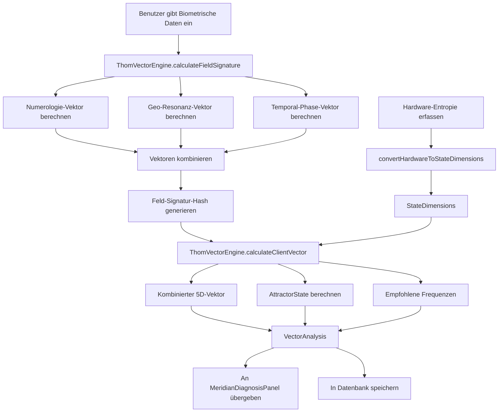
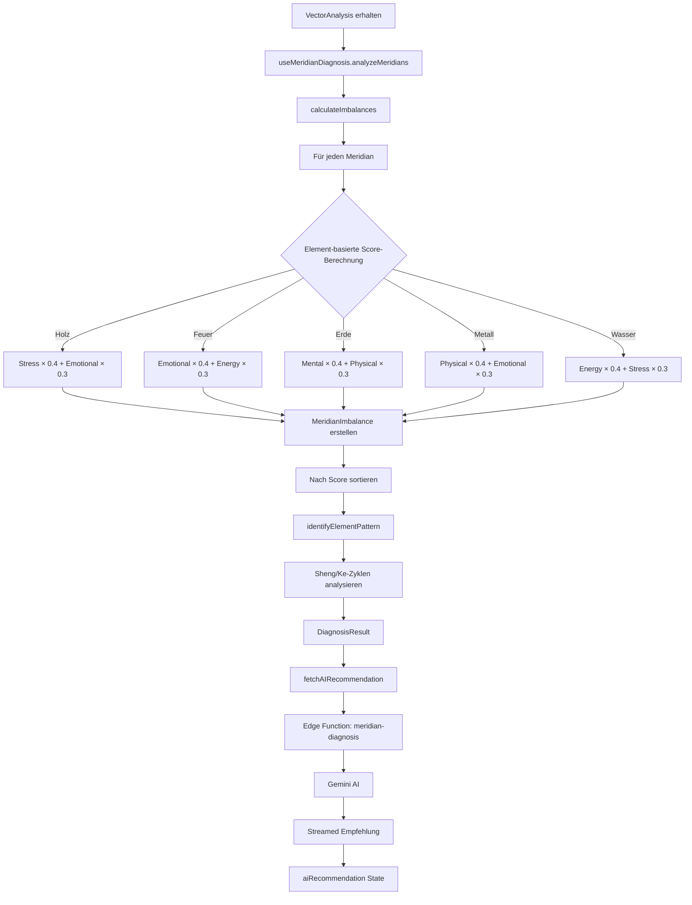
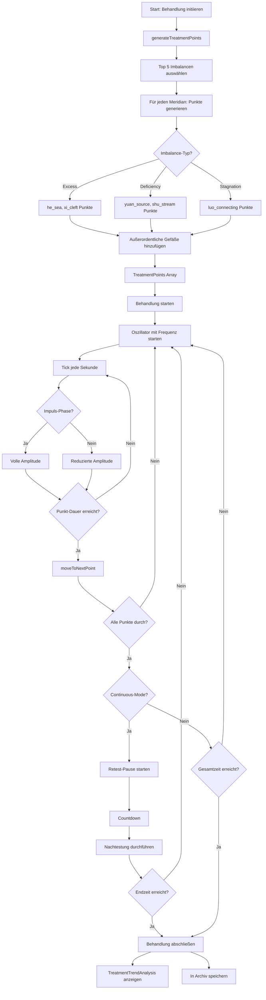
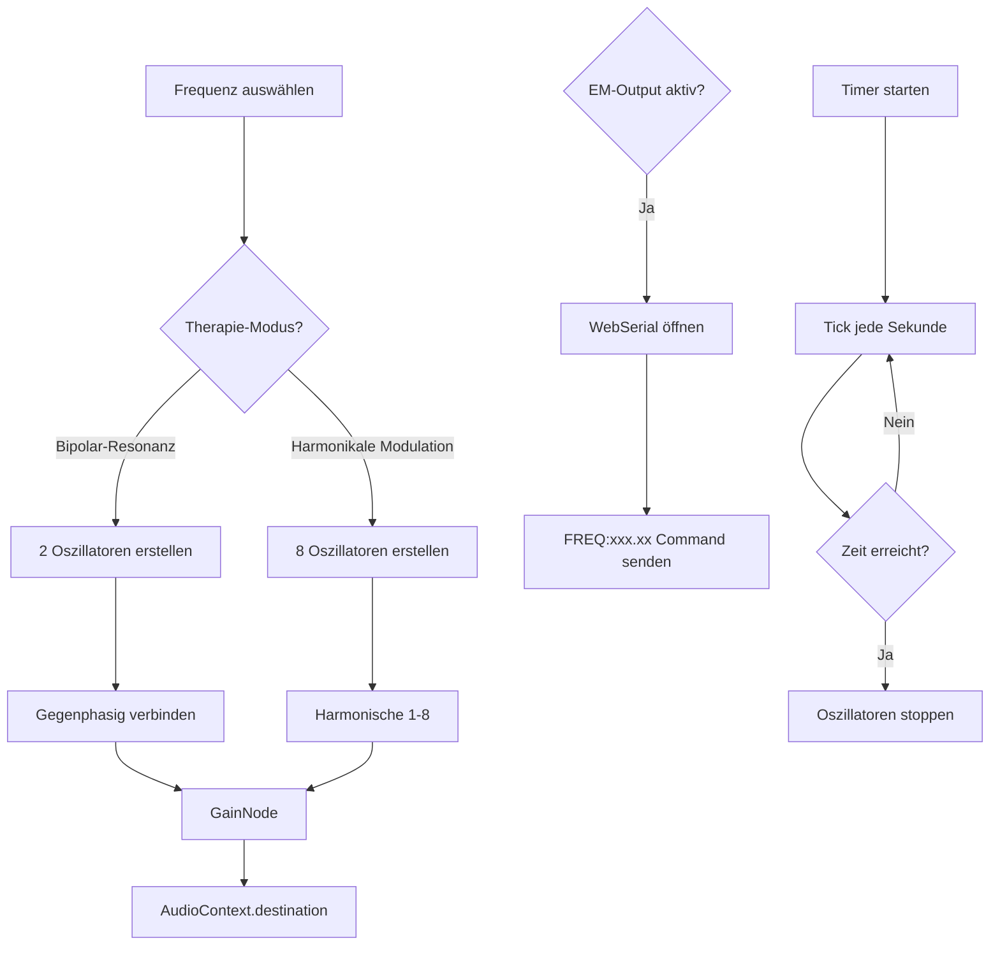

# Feldengine - Vollständige Projektdokumentation

## Inhaltsverzeichnis

1. [Projektübersicht](#1-projektübersicht)
2. [Technologie-Stack](#2-technologie-stack)
3. [Projektstruktur](#3-projektstruktur)
4. [Kernkonzepte](#4-kernkonzepte)
5. [Datenbank-Schema](#5-datenbank-schema)
6. [Services & Engines](#6-services--engines)
7. [React Hooks](#7-react-hooks)
8. [Komponenten](#8-komponenten)
9. [Edge Functions](#9-edge-functions)
10. [Workflows & Datenflüsse](#10-workflows--datenflüsse)
11. [Schritt-für-Schritt Umsetzungsplan](#11-schritt-für-schritt-umsetzungsplan)

---

## 1. Projektübersicht

### 1.1 Vision & Konzept

Die **Feldengine** ist eine therapeutische Plattform, die **René Thoms Morphogenese- und Katastrophentheorie** mit **Frequenztherapie** (basierend auf Baklayan/Kuklinski-Ansätzen) verbindet. Das System modelliert Heilungsprozesse als Übergänge zu stabilen Attraktoren (Chreoden) innerhalb dynamischer Systeme.

### 1.2 Hauptfunktionalitäten

| Feature | Beschreibung |
|---------|-------------|
| **Klienten-Vektor-Berechnung** | Biometrische Daten (Name, Geburtsdatum, Geburtsort) werden zu einer Feld-Signatur und einem 5D-Zustandsvektor verarbeitet |
| **Hardware-Entropie-Integration** | Echtzeit CPU/GPU/RAM-Metriken beeinflussen die Vektor-Berechnung |
| **Meridian-Diagnose** | KI-gestützte Analyse von TCM-Meridian-Imbalancen basierend auf dem Klienten-Vektor |
| **409-Punkte Akupunktur-Datenbank** | WHO-Standard Akupunkturpunkte mit berechneten Frequenzen |
| **Automatische Behandlungssequenz** | Zyklische Frequenz-Harmonisierung mit Impulse/Pause-Logik |
| **Frequenz-Output** | WebAudio API für Audio-Ausgabe, WebSerial für EM-Feld-Generatoren |
| **Echtzeit-Synchronisation** | WebSocket-basierte Multi-Client-Synchronisation |
| **3D-Visualisierung** | Three.js-basierte Darstellung von Trajektorien und Anatomie |
| **Trendanalyse** | Visualisierung von Behandlungsfortschritten |

### 1.3 Zielgruppe

- Therapeuten (registrierte Benutzer)
- Klienten (werden von Therapeuten verwaltet)

---

## 2. Technologie-Stack

### 2.1 Frontend

| Technologie | Version | Verwendungszweck |
|-------------|---------|------------------|
| React | ^18.3.1 | UI-Framework |
| TypeScript | - | Typisierung |
| Vite | - | Build-Tool |
| Tailwind CSS | - | Styling |
| Framer Motion | ^12.23.26 | Animationen |
| Three.js | ^0.170.0 | 3D-Visualisierung |
| @react-three/fiber | ^8.18.0 | React-Three.js-Bridge |
| @react-three/drei | ^9.122.0 | Three.js-Helfer |
| TanStack React Query | ^5.83.0 | Server-State-Management |
| React Router DOM | ^6.30.1 | Routing |
| React Helmet Async | ^2.0.5 | SEO |
| Recharts | ^2.15.4 | Charts |
| Sonner | ^1.7.4 | Toast-Notifications |
| Zod | ^3.25.76 | Validierung |
| React Hook Form | ^7.61.1 | Formular-Handling |

### 2.2 UI-Komponenten (shadcn/ui)

Alle Standard-shadcn-Komponenten sind installiert:
- Accordion, Alert, Avatar, Badge, Button, Card, Carousel
- Checkbox, Collapsible, Command, Dialog, Dropdown
- Form, Input, Label, Popover, Progress, Radio, Select
- Separator, Sheet, Slider, Switch, Tabs, Toast, Tooltip
- etc.

### 2.3 Backend (Lovable Cloud / Supabase)

| Service | Verwendung |
|---------|------------|
| Supabase Database | PostgreSQL für Persistenz |
| Supabase Auth | Benutzerauthentifizierung |
| Supabase Storage | Klienten-Fotos |
| Edge Functions (Deno) | Server-seitige Logik |
| WebSockets | Echtzeit-Kommunikation |

---

## 3. Projektstruktur

```
feldengine/
├── src/
│   ├── components/
│   │   ├── ui/                    # shadcn/ui Basiskomponenten
│   │   ├── anatomy/               # Anatomie-spezifische Komponenten
│   │   │   ├── DetailedHumanModel.tsx
│   │   │   ├── DysregulationLegend.tsx
│   │   │   └── InteractiveMeridianPoints.tsx
│   │   ├── AcupuncturePointSearch.tsx
│   │   ├── AnatomyResonanceViewer.tsx
│   │   ├── ChreodeCard.tsx
│   │   ├── ClientVectorInterface.tsx
│   │   ├── ClientVectorTrajectory3D.tsx
│   │   ├── ConceptSection.tsx
│   │   ├── CuspSurface3D.tsx
│   │   ├── CuspVisualization.tsx
│   │   ├── FieldVisualization.tsx
│   │   ├── Footer.tsx
│   │   ├── FrequencyOutputModule.tsx
│   │   ├── FrequencyTherapySection.tsx
│   │   ├── HardwareMethodSelector.tsx
│   │   ├── Hero.tsx
│   │   ├── MeridianDiagnosisPanel.tsx
│   │   ├── NavLink.tsx
│   │   ├── RealtimeStatusWidget.tsx
│   │   ├── SystemStatusDashboard.tsx
│   │   ├── ThomResources.tsx
│   │   └── TreatmentTrendAnalysis.tsx
│   │
│   ├── hooks/
│   │   ├── useClientDatabase.ts       # Klienten-CRUD
│   │   ├── useHardwareDiscovery.ts    # WebUSB/WebSerial
│   │   ├── useMeridianDiagnosis.ts    # TCM-Diagnose
│   │   ├── useRealtimeHarmonization.ts # Audio-Ausgabe
│   │   ├── useRealtimeSync.ts         # WebSocket-Client
│   │   ├── useResonanceDatabase.ts    # Word Energies / Anatomy Points
│   │   ├── useServerHardwareMetrics.ts # Server-Metriken via WebSocket
│   │   ├── useSystemMonitor.ts        # Lokales System-Monitoring
│   │   ├── useTreatmentArchive.ts     # Behandlungshistorie
│   │   ├── useTreatmentSequence.ts    # Behandlungsablauf
│   │   ├── use-mobile.tsx
│   │   └── use-toast.ts
│   │
│   ├── pages/
│   │   ├── Index.tsx         # Landing Page
│   │   ├── Analyse.tsx       # Hauptfunktionalität
│   │   ├── Login.tsx         # Authentifizierung
│   │   └── NotFound.tsx
│   │
│   ├── services/
│   │   ├── feldengine/
│   │   │   ├── ThomVectorEngine.ts   # Vektor-Berechnungen
│   │   │   └── index.ts
│   │   ├── hardware/
│   │   │   ├── deviceProfiles.ts         # Hardware-Profile
│   │   │   ├── HardwareDiscoveryService.ts
│   │   │   ├── SystemMonitorService.ts   # System-Metriken
│   │   │   └── index.ts
│   │   ├── harmonization/
│   │   │   ├── HarmonizationJobService.ts
│   │   │   └── index.ts
│   │   └── realtime/
│   │       └── RealtimeSyncService.ts    # WebSocket-Client
│   │
│   ├── types/
│   │   ├── hardware.ts           # Hardware-Interfaces
│   │   └── webapis.d.ts          # WebUSB/WebSerial Typen
│   │
│   ├── utils/
│   │   ├── meridianPoints/       # Modulare Meridian-Daten
│   │   │   ├── index.ts
│   │   │   ├── bladder.ts
│   │   │   ├── gallbladder.ts
│   │   │   ├── heart.ts
│   │   │   ├── kidney.ts
│   │   │   ├── liver.ts
│   │   │   ├── pericardium.ts
│   │   │   ├── smallIntestine.ts
│   │   │   ├── spleen.ts
│   │   │   └── tripleWarmer.ts
│   │   └── meridianPointsDatabase.ts  # Hauptdatenbank
│   │
│   ├── integrations/supabase/
│   │   ├── client.ts         # Supabase-Client (auto-generated)
│   │   └── types.ts          # Datenbank-Typen (auto-generated)
│   │
│   ├── lib/
│   │   └── utils.ts          # Utility-Funktionen (cn, etc.)
│   │
│   ├── App.tsx               # Root-Komponente mit Routing
│   ├── main.tsx              # Entry Point
│   └── index.css             # Globale Styles & Tailwind
│
├── supabase/
│   ├── functions/
│   │   ├── hardware-metrics/     # Server-Hardware-Metriken
│   │   │   └── index.ts
│   │   ├── meridian-diagnosis/   # KI-Diagnose
│   │   │   └── index.ts
│   │   └── realtime-sync/        # WebSocket-Server
│   │       └── index.ts
│   └── config.toml               # Supabase-Konfiguration
│
├── public/
│   ├── favicon.ico
│   ├── placeholder.svg
│   └── robots.txt
│
├── docs/
│   └── FELDENGINE_COMPLETE_DOCUMENTATION.md  # Diese Datei
│
├── .env                      # Umgebungsvariablen
├── index.html
├── tailwind.config.ts
├── vite.config.ts
└── package.json
```

---

## 4. Kernkonzepte

### 4.1 Thom-Vektor-Engine

Die Thom-Vektor-Engine berechnet eine eindeutige **Feld-Signatur** basierend auf biometrischen Daten.

#### Eingabedaten (BiometricClientData)

```typescript
interface BiometricClientData {
  firstName: string;
  lastName: string;
  birthDate: Date;
  birthPlace: string;
  photoData?: string;  // Base64 oder URL
}
```

#### Berechnung der Feld-Signatur

1. **Numerologie-Vektor** (Name-basiert nach Pythagoras)
   - `nameValue`: Summe aller Buchstabenwerte
   - `vowelValue`: Summe der Vokale
   - `consonantValue`: Summe der Konsonanten
   - `lifePathNumber`: Aus Geburtsdatum

2. **Geo-Resonanz-Vektor** (Geburtsort-basiert)
   - `placeHash`: Hash des Ortsnamens
   - `harmonics`: Schumann-basierte Frequenzen

3. **Temporal-Phase-Vektor** (Geburtsdatum-basiert)
   - `dayPhase`: Position im Monat (0-1)
   - `monthPhase`: Position im Jahr (0-1)
   - `yearCycle`: 9-Jahres-Zyklus
   - `seasonalResonance`: Saisonale Komponente

#### Zustandsdimensionen (StateDimensions)

```typescript
interface StateDimensions {
  physical: number;    // 0-100
  emotional: number;   // 0-100
  mental: number;      // 0-100
  energy: number;      // 0-100
  stress: number;      // 0-100
}
```

Die Zustandsdimensionen werden aus **Hardware-Entropie** (CPU, GPU, RAM, Latenz) berechnet.

#### Kombinierter Vektor

```typescript
// Gewichtung: 30% Feld-Signatur, 70% aktueller Zustand
combinedDimensions = stateVector.map((s, i) => {
  const fieldComponent = fieldSignature.combinedVector[i];
  return 0.3 * fieldComponent + 0.7 * s;
});
```

#### Attraktor-Zustand

```typescript
interface AttractorState {
  position: number[];         // 5D-Position
  stability: number;          // 0-1
  bifurcationRisk: number;    // 0-1
  phase: 'approach' | 'transition' | 'stable';
  chreodeAlignment: number;   // Ausrichtung zum Entwicklungspfad
}
```

### 4.2 TCM-Meridian-System

#### Die 12 Hauptmeridiane

| Kürzel | Name | Element | Yin/Yang | Organ |
|--------|------|---------|----------|-------|
| LU | Lungen-Meridian | Metall | Yin | Lunge |
| LI | Dickdarm-Meridian | Metall | Yang | Dickdarm |
| ST | Magen-Meridian | Erde | Yang | Magen |
| SP | Milz-Meridian | Erde | Yin | Milz |
| HT | Herz-Meridian | Feuer | Yin | Herz |
| SI | Dünndarm-Meridian | Feuer | Yang | Dünndarm |
| BL | Blasen-Meridian | Wasser | Yang | Blase |
| KI | Nieren-Meridian | Wasser | Yin | Niere |
| PC | Perikard-Meridian | Minister-Feuer | Yin | Perikard |
| TE | Dreifacher Erwärmer | Minister-Feuer | Yang | San Jiao |
| GB | Gallenblasen-Meridian | Holz | Yang | Gallenblase |
| LR | Leber-Meridian | Holz | Yin | Leber |

#### Die 8 Außerordentlichen Gefäße (Qi Jing Ba Mai)

| Kürzel | Name | Funktion | Öffnungspunkt | Frequenz |
|--------|------|----------|---------------|----------|
| DU | Du Mai (Lenkergefäß) | Regiert Yang | SI3 | 136.1 Hz |
| REN | Ren Mai (Konzeptionsgefäß) | Regiert Yin | LU7 | 141.3 Hz |
| CHONG | Chong Mai (Durchdringungsgefäß) | Reguliert Blut | SP4 | 144.7 Hz |
| DAI | Dai Mai (Gürtelgefäß) | Bindet Meridiane | GB41 | 147.9 Hz |
| YANGQIAO | Yang Qiao Mai | Schlaf-Wach-Rhythmus | BL62 | 152.8 Hz |
| YINQIAO | Yin Qiao Mai | Fördert Schlaf | KI6 | 158.4 Hz |
| YANGWEI | Yang Wei Mai | Verteidigung außen | TE5 | 164.2 Hz |
| YINWEI | Yin Wei Mai | Reguliert Herz/Brust | PC6 | 170.6 Hz |

#### Wu Xing (Fünf Elemente) Zyklen

**Sheng-Zyklus (Erzeugung):**
```
Holz → Feuer → Erde → Metall → Wasser → Holz
```

**Ke-Zyklus (Kontrolle):**
```
Holz kontrolliert Erde
Feuer kontrolliert Metall
Erde kontrolliert Wasser
Metall kontrolliert Holz
Wasser kontrolliert Feuer
```

### 4.3 Frequenz-Berechnung

Die Frequenzen basieren auf einer Synthese aus:
- **Paul-Schmidt-Bioresonanz**: Regulationswerte
- **Baklayan-Harmonik-Theorie**: Obertöne und Modulationen
- **Gewebe-Widerstand**: Körperregion-spezifisch
- **Organ-Uhr**: TCM-Tageszeit-Zuordnung
- **Element-Zuordnung**: Fünf-Elemente-Frequenzen
- **Chakra-Frequenzen**: Energiezentren

#### Basis-Frequenzen nach Element

```typescript
const ELEMENT_BASE_FREQUENCIES = {
  wood: 174.0,   // 174 Hz
  fire: 285.0,   // 285 Hz
  earth: 396.0,  // 396 Hz (Solfeggio)
  metal: 528.0,  // 528 Hz (Solfeggio)
  water: 639.0,  // 639 Hz (Solfeggio)
};
```

#### Frequenz-Algorithmus

```typescript
function calculateFrequency(point) {
  const baseFreq = ELEMENT_BASE_FREQUENCIES[point.element];
  const organClockMod = getOrganClockModifier(point.meridian);
  const tissueResistance = getTissueResistance(point.bodyRegion);
  const chakraMod = getChakraModifier(point.chakra);
  
  return baseFreq * organClockMod * tissueResistance * chakraMod;
}
```

---

## 5. Datenbank-Schema

### 5.1 Tabellen

#### clients

Speichert Klienten-Stammdaten.

| Spalte | Typ | Nullable | Default | Beschreibung |
|--------|-----|----------|---------|--------------|
| id | uuid | No | gen_random_uuid() | Primärschlüssel |
| first_name | text | No | - | Vorname |
| last_name | text | No | - | Nachname |
| birth_date | date | No | - | Geburtsdatum |
| birth_place | text | No | - | Geburtsort |
| photo_url | text | Yes | - | URL zum Foto |
| field_signature | text | Yes | - | Berechnete Feld-Signatur |
| notes | text | Yes | - | Notizen |
| created_at | timestamptz | No | now() | Erstelldatum |
| updated_at | timestamptz | No | now() | Änderungsdatum |

#### client_vectors

Speichert berechnete Klienten-Vektoren pro Sitzung.

| Spalte | Typ | Nullable | Default | Beschreibung |
|--------|-----|----------|---------|--------------|
| id | uuid | No | gen_random_uuid() | Primärschlüssel |
| client_id | uuid | No | - | FK zu clients |
| session_id | text | No | - | Sitzungs-ID |
| dimension_physical | double | No | - | Physische Dimension |
| dimension_emotional | double | No | - | Emotionale Dimension |
| dimension_mental | double | No | - | Mentale Dimension |
| dimension_energy | double | No | - | Energie-Dimension |
| dimension_stress | double | No | - | Stress-Dimension |
| phase | text | Yes | - | Attraktor-Phase |
| attractor_distance | double | Yes | - | Distanz zum Attraktor |
| primary_concern | text | Yes | - | Hauptbeschwerde |
| notes | text | Yes | - | Notizen |
| input_method | text | Yes | 'manual' | Eingabemethode |
| sensor_data | jsonb | Yes | - | Rohe Sensordaten |
| gsr_value | double | Yes | - | Galvanic Skin Response |
| hrv_value | double | Yes | - | Heart Rate Variability |
| created_at | timestamptz | No | now() | Erstelldatum |

#### harmonization_protocols

Speichert durchgeführte Harmonisierungen.

| Spalte | Typ | Nullable | Default | Beschreibung |
|--------|-----|----------|---------|--------------|
| id | uuid | No | gen_random_uuid() | Primärschlüssel |
| client_id | uuid | No | - | FK zu clients |
| vector_id | uuid | Yes | - | FK zu client_vectors |
| frequency | double | No | - | Frequenz in Hz |
| amplitude | double | No | 0.5 | Amplitude (0-1) |
| waveform | text | No | 'sine' | Wellenform |
| output_type | text | No | 'audio' | Ausgabetyp |
| duration_seconds | int | Yes | - | Dauer in Sekunden |
| modulation_enabled | bool | Yes | false | Modulation aktiv |
| modulation_type | text | Yes | - | Modulationstyp |
| modulation_frequency | double | Yes | - | Modulationsfrequenz |
| modulation_depth | double | Yes | - | Modulationstiefe |
| status | text | Yes | 'pending' | Status |
| started_at | timestamptz | Yes | - | Startzeit |
| completed_at | timestamptz | Yes | - | Endzeit |
| effectiveness_rating | int | Yes | - | Bewertung (1-10) |
| result_notes | text | Yes | - | Ergebnisnotizen |
| created_at | timestamptz | No | now() | Erstelldatum |

#### harmonization_jobs

Speichert Hintergrund-Jobs für Harmonisierung.

| Spalte | Typ | Nullable | Default | Beschreibung |
|--------|-----|----------|---------|--------------|
| id | uuid | No | gen_random_uuid() | Primärschlüssel |
| client_id | uuid | No | - | FK zu clients |
| vector_id | uuid | Yes | - | FK zu client_vectors |
| protocol_id | uuid | Yes | - | FK zu protocols |
| job_type | text | No | 'harmonization' | Job-Typ |
| status | text | No | 'pending' | Status |
| progress | double | Yes | 0 | Fortschritt (0-100) |
| priority | int | Yes | 1 | Priorität |
| target_frequencies | double[] | Yes | - | Zielfrequenzen |
| target_anatomy_points | text[] | Yes | - | Zielpunkte |
| target_word_energies | text[] | Yes | - | Ziel-Wortenergien |
| result_data | jsonb | Yes | - | Ergebnisdaten |
| error_message | text | Yes | - | Fehlermeldung |
| started_at | timestamptz | Yes | - | Startzeit |
| completed_at | timestamptz | Yes | - | Endzeit |
| created_at | timestamptz | No | now() | Erstelldatum |

#### word_energies

Speichert Wort-Frequenz-Zuordnungen.

| Spalte | Typ | Nullable | Default | Beschreibung |
|--------|-----|----------|---------|--------------|
| id | uuid | No | gen_random_uuid() | Primärschlüssel |
| word | text | No | - | Wort |
| frequency | double | No | - | Frequenz in Hz |
| amplitude | double | Yes | 0.5 | Amplitude |
| category | text | No | - | Kategorie |
| language | text | Yes | 'de' | Sprache |
| meridian | text | Yes | - | Zugeordneter Meridian |
| organ_system | text | Yes | - | Organsystem |
| emotional_quality | text | Yes | - | Emotionale Qualität |
| chakra | text | Yes | - | Chakra |
| description | text | Yes | - | Beschreibung |
| created_at | timestamptz | No | now() | Erstelldatum |

#### anatomy_resonance_points

Speichert anatomische Resonanzpunkte.

| Spalte | Typ | Nullable | Default | Beschreibung |
|--------|-----|----------|---------|--------------|
| id | uuid | No | gen_random_uuid() | Primärschlüssel |
| name | text | No | - | Name |
| name_latin | text | Yes | - | Lateinischer Name |
| body_region | text | No | - | Körperregion |
| x_position | double | No | - | X-Koordinate |
| y_position | double | No | - | Y-Koordinate |
| z_position | double | No | - | Z-Koordinate |
| primary_frequency | double | No | - | Primärfrequenz |
| harmonic_frequencies | double[] | Yes | - | Harmonische |
| description | text | Yes | - | Beschreibung |
| meridian_associations | text[] | Yes | - | Meridiane |
| organ_associations | text[] | Yes | - | Organe |
| emotional_associations | text[] | Yes | - | Emotionen |
| created_at | timestamptz | No | now() | Erstelldatum |

### 5.2 Row Level Security (RLS)

```sql
-- clients: Voller Zugriff
CREATE POLICY "Allow all operations on clients" 
ON public.clients FOR ALL 
USING (true) WITH CHECK (true);

-- client_vectors: Voller Zugriff
CREATE POLICY "Allow all operations on client_vectors" 
ON public.client_vectors FOR ALL 
USING (true) WITH CHECK (true);

-- harmonization_protocols: Voller Zugriff
CREATE POLICY "Allow all operations on harmonization_protocols" 
ON public.harmonization_protocols FOR ALL 
USING (true) WITH CHECK (true);

-- harmonization_jobs: Voller Zugriff
CREATE POLICY "Allow all operations on harmonization_jobs" 
ON public.harmonization_jobs FOR ALL 
USING (true) WITH CHECK (true);

-- word_energies: Nur Lesen
CREATE POLICY "Word energies are publicly readable" 
ON public.word_energies FOR SELECT 
USING (true);

-- anatomy_resonance_points: Nur Lesen
CREATE POLICY "Anatomy points are publicly readable" 
ON public.anatomy_resonance_points FOR SELECT 
USING (true);
```

### 5.3 Storage Buckets

| Bucket | Öffentlich | Verwendung |
|--------|------------|------------|
| client-photos | Ja | Klienten-Fotos für Vektor-Berechnung |

---

## 6. Services & Engines

### 6.1 ThomVectorEngine

**Pfad:** `src/services/feldengine/ThomVectorEngine.ts`

#### Öffentliche Methoden

```typescript
class ThomVectorEngine {
  // Berechnet vollständige Feld-Signatur
  static calculateFieldSignature(data: BiometricClientData): FieldSignature;
  
  // Berechnet vollständigen Klienten-Vektor
  static calculateClientVector(
    biometricData: BiometricClientData,
    stateDimensions: StateDimensions,
    sessionId: string
  ): VectorAnalysis;
  
  // Analysiert Foto (Placeholder für zukünftige AI-Integration)
  static async analyzePhoto(photoData: string): Promise<number[]>;
}
```

#### Algorithmus-Details

1. **Numerologie nach Pythagoras:**
   ```typescript
   const LETTER_VALUES = {
     'a': 1, 'b': 2, ... 'z': 8,
     'ä': 5, 'ö': 6, 'ü': 3, 'ß': 1
   };
   ```

2. **Reduktion auf Meisterzahlen:**
   ```typescript
   while (n > 9 && n !== 11 && n !== 22 && n !== 33) {
     n = String(n).split('').reduce((sum, d) => sum + parseInt(d), 0);
   }
   ```

### 6.2 SystemMonitorService

**Pfad:** `src/services/hardware/SystemMonitorService.ts`

Simuliert Hardware-Metriken für Entwicklung und Produktion.

```typescript
class SystemMonitorService {
  setMode(mode: 'development' | 'production'): void;
  getServerConfig(): ServerHardware;
  start(intervalMs: number): void;
  stop(): void;
  addMetricsListener(callback: MetricsCallback): void;
  measureWebSocketLatency(wsUrl: string): Promise<number>;
  measureNetworkLatency(endpoint: string): Promise<number>;
}
```

### 6.3 RealtimeSyncService

**Pfad:** `src/services/realtime/RealtimeSyncService.ts`

WebSocket-Client für Echtzeit-Synchronisation.

```typescript
class RealtimeSyncService {
  connect(): void;
  disconnect(): void;
  sendVectorUpdate(data: VectorUpdateData): void;
  sendFrequencySync(data: FrequencySyncData): void;
  sendHardwareStatus(data: HardwareStatusData): void;
  sendSessionEvent(data: SessionEventData): void;
  addEventListener(type: RealtimeEventType, callback: EventCallback): void;
}
```

### 6.4 HarmonizationJobService

**Pfad:** `src/services/harmonization/HarmonizationJobService.ts`

Verwaltet Hintergrund-Jobs für Harmonisierungsprozesse.

---

## 7. React Hooks

### 7.1 useClientDatabase

**Pfad:** `src/hooks/useClientDatabase.ts`

CRUD-Operationen für Klienten und deren Vektoren.

```typescript
interface UseClientDatabaseReturn {
  isLoading: boolean;
  clients: ClientRecord[];
  createClient(biometricData, notes): Promise<ClientRecord | null>;
  loadClients(): Promise<ClientRecord[]>;
  getClient(clientId: string): Promise<ClientRecord | null>;
  saveClientVector(clientId, dimensions, biometricData, options): Promise<void>;
  loadClientVectors(clientId: string): Promise<ClientVectorRecord[]>;
  uploadClientPhoto(clientId: string, file: File): Promise<string | null>;
}
```

### 7.2 useMeridianDiagnosis

**Pfad:** `src/hooks/useMeridianDiagnosis.ts`

Analysiert Klienten-Vektoren und identifiziert Meridian-Imbalancen.

```typescript
interface UseMeridianDiagnosisReturn {
  isAnalyzing: boolean;
  isLoadingAI: boolean;
  diagnosisResult: DiagnosisResult | null;
  aiRecommendation: string;
  analyzeMeridians(vectorAnalysis: VectorAnalysis): Promise<DiagnosisResult | null>;
}
```

#### Imbalance-Berechnung

```typescript
interface MeridianImbalance {
  meridianId: string;
  meridianName: string;
  element: string;
  yinYang: 'yin' | 'yang';
  imbalanceScore: number;           // 0-1
  imbalanceType: 'excess' | 'deficiency' | 'stagnation';
  affectedOrgan: string;
  recommendedPoints: string[];
  frequency: number;
}
```

### 7.3 useTreatmentSequence

**Pfad:** `src/hooks/useTreatmentSequence.ts`

Orchestriert die automatische Behandlungssequenz.

```typescript
interface UseTreatmentSequenceReturn {
  treatmentPoints: TreatmentPoint[];
  progress: TreatmentProgress;
  startSequence(imbalances, options, retestCallback?): void;
  pauseSequence(): void;
  resumeSequence(): void;
  stopSequence(): void;
  skipToPoint(index: number): void;
  generateTreatmentPoints(imbalances, pointsPerMeridian, duration, includeVessels): TreatmentPoint[];
}
```

#### TreatmentProgress

```typescript
interface TreatmentProgress {
  currentPointIndex: number;
  totalPoints: number;
  currentPoint: TreatmentPoint | null;
  elapsedTime: number;
  remainingTime: number;
  isPlaying: boolean;
  isPaused: boolean;
  isComplete: boolean;
  overallProgress: number;
  isImpulsePhase: boolean;        // true = Ton, false = Pause
  currentCycle: number;
  totalCycles: number;
  totalTreatmentTime: number;
  elapsedTotalTime: number;
  // Continuous-Mode
  isContinuousMode: boolean;
  continuousEndTime: Date | null;
  awaitingRetest: boolean;
  retestPauseRemaining: number;
}
```

#### Behandlungs-Workflow

1. Punkte werden basierend auf Imbalancen generiert
2. Impulse/Pause-Logik (z.B. 30s Ton, 5s Pause)
3. Nach Zyklus-Ende: optionale Retest-Pause
4. Automatische Nachtestung
5. Fortsetzung bis Endzeit erreicht
6. Trendanalyse generieren

### 7.4 useServerHardwareMetrics

**Pfad:** `src/hooks/useServerHardwareMetrics.ts`

WebSocket-Verbindung zu Server-Hardware-Metriken.

```typescript
interface UseServerHardwareMetricsReturn {
  isConnected: boolean;
  metrics: ServerHardwareMetrics | null;
  entropy: EntropyData | null;
  serverConfig: ServerConfig | null;
  latency: number;
  connect(): void;
  disconnect(): void;
  getLatestMetrics(): ServerHardwareMetrics | null;
  getLatestEntropy(): EntropyData | null;
}
```

### 7.5 useRealtimeHarmonization

**Pfad:** `src/hooks/useRealtimeHarmonization.ts`

Steuert Echtzeit-Audio-Harmonisierung.

```typescript
interface UseRealtimeHarmonizationReturn {
  state: RealtimeHarmonizationState;
  initialize(): Promise<void>;
  startHarmonization(config: HarmonizationConfig): void;
  stopHarmonization(): void;
  setFrequency(frequency: number): void;
  setAmplitude(amplitude: number): void;
  requestGPUCalculation(params): Promise<GPUCalculationResult>;
}
```

### 7.6 useHardwareDiscovery

**Pfad:** `src/hooks/useHardwareDiscovery.ts`

Erkennt externe Hardware via WebUSB/WebSerial.

```typescript
interface UseHardwareDiscoveryReturn {
  devices: ExternalDevice[];
  isInitialized: boolean;
  isWebUSBSupported: boolean;
  isWebSerialSupported: boolean;
  getDevicesByType(type: DeviceType): ExternalDevice[];
  requestUSBDAC(): Promise<ExternalDevice | null>;
  requestFrequencyGenerator(): Promise<ExternalDevice | null>;
  requestMicrocontroller(): Promise<ExternalDevice | null>;
  requestAnyUSBDevice(): Promise<ExternalDevice | null>;
  requestAnySerialPort(): Promise<ExternalDevice | null>;
}
```

---

## 8. Komponenten

### 8.1 Seiten

#### Index.tsx (Landing Page)

```
/
├── Hero
├── ConceptSection
├── CuspVisualization
├── CuspSurface3D
├── FrequencyTherapySection
├── CTA zur Analyse-Seite
├── ThomResources
├── SystemStatusDashboard
└── Footer
```

#### Analyse.tsx (Hauptfunktionalität)

```
/analyse
├── Header mit Navigation
├── TreatmentTrendAnalysis (Overlay nach Behandlung)
├── ClientVectorInterface
├── ClientVectorTrajectory3D
├── AnatomyResonanceViewer
├── MeridianDiagnosisPanel
├── FrequencyOutputModule
├── Footer
└── RealtimeStatusWidget
```

#### Login.tsx

- Nur Email/Passwort-Login
- Keine Registrierung
- Redirect bei bestehender Session

### 8.2 Kern-Komponenten

#### ClientVectorInterface

**Größe:** ~850 Zeilen

**Funktionen:**
- Biometrische Dateneingabe (Name, Geburtsdatum, Geburtsort, Foto)
- Hardware-Entropie-Erfassung
- Zustandsdimensionen-Slider (optional manuell)
- Vektor-Berechnung via ThomVectorEngine
- Klienten-Liste und -Auswahl
- Speichern in Datenbank

**State:**
```typescript
const [biometric, setBiometric] = useState<BiometricData>(defaultBiometric);
const [dimensions, setDimensions] = useState<StateDimensions>(defaultDimensions);
const [manualOverride, setManualOverride] = useState(false);
const [continuousUpdate, setContinuousUpdate] = useState(false);
const [currentAnalysis, setCurrentAnalysis] = useState<VectorAnalysis | null>(null);
```

#### MeridianDiagnosisPanel

**Größe:** ~1230 Zeilen

**Funktionen:**
- Zeigt Diagnose-Ergebnisse
- Element-Muster (primär, kontrollierend, unterstützend)
- Liste der Meridian-Imbalancen
- KI-Empfehlungen (via Edge Function)
- Behandlungssequenz-Steuerung
- Zeiteinstellungen (Sekunden/Minuten)
- Hardware-Methoden-Auswahl
- Nachtestungs-Countdown
- Behandlungsarchiv

**Tabs:**
1. `treatment`: Aktive Behandlung
2. `archive`: Behandlungshistorie
3. `retest`: Nachtestungs-Optionen

#### FrequencyOutputModule

**Größe:** ~725 Zeilen

**Modi:**
1. **Bipolar-Resonanz**: Gegenphasige Oszillatoren
2. **Harmonikale Modulation**: Grundton + Obertöne

**Funktionen:**
- Frequenz-Slider (0.1 Hz - 20 kHz)
- Amplitude-Steuerung
- Wellenform-Auswahl (Sinus, Rechteck, Dreieck, Sägezahn)
- Timer mit Auto-Stop
- Preset-Frequenzen (Schumann, Alpha, Solfeggio, etc.)
- WebSerial für EM-Feld-Generatoren
- Akupunkturpunkt-Suche

#### AnatomyResonanceViewer

**Größe:** ~1524 Zeilen

**Funktionen:**
- 3D-Ganzkörpermodell (prozedural)
- 12 TCM-Hauptmeridiane als Linien
- Interaktive Akupunkturpunkte
- Dysregulations-Farbskala (grün bis rot)
- Hover-Labels
- Ansichtswechsel (Ganzkörper, Meridiane, Herz, Gehirn)
- Frequenz-Trigger bei Punktklick

**Views:**
- `full_body`: Vollständige Körperansicht
- `meridians`: Meridian-Fokus
- `heart`: Herz-Detail
- `brain`: Gehirn-Detail

#### ClientVectorTrajectory3D

3D-Visualisierung der Vektor-Trajektorie im Kuspen-Raum.

#### TreatmentTrendAnalysis

Zeigt Behandlungsfortschritte:
- Dimensionen vorher/nachher
- Harmonisierungsfortschritt
- Element-Balance
- Behandlungsdauer und Zyklen

### 8.3 Hilfs-Komponenten

| Komponente | Beschreibung |
|------------|--------------|
| AcupuncturePointSearch | Suche in 409-Punkte-Datenbank |
| HardwareMethodSelector | Auswahl der Harmonisierungsmethode |
| RealtimeStatusWidget | Zeigt Verbindungsstatus |
| SystemStatusDashboard | Server-Metriken-Anzeige |
| DysregulationLegend | Farbskala-Legende |
| InteractiveMeridianPoints | Klickbare Punkte auf Meridian |

---

## 9. Edge Functions

### 9.1 meridian-diagnosis

**Pfad:** `supabase/functions/meridian-diagnosis/index.ts`

KI-gestützte Meridian-Diagnose und Behandlungsempfehlungen.

**Endpunkt:** `POST /functions/v1/meridian-diagnosis`

**Request:**
```json
{
  "clientVector": {
    "physical": 0.3,
    "emotional": -0.2,
    "stress": 0.5,
    "energy": -0.1,
    "mental": 0.2
  },
  "imbalances": [
    {
      "meridianId": "LR",
      "meridianName": "Leber-Meridian",
      "imbalanceType": "excess",
      "imbalanceScore": 0.8
    }
  ]
}
```

**Response:** Server-Sent Events (SSE) mit KI-generiertem Text

**KI-Provider:** Lovable AI Gateway (Google Gemini)

### 9.2 hardware-metrics

**Pfad:** `supabase/functions/hardware-metrics/index.ts`

Streamt simulierte Server-Hardware-Metriken.

**Endpunkte:**
- `GET /functions/v1/hardware-metrics/metrics` - Einzelne Metrik-Abfrage
- `GET /functions/v1/hardware-metrics/config` - Server-Konfiguration
- `WebSocket /functions/v1/hardware-metrics` - Echtzeit-Streaming

**WebSocket-Nachrichten:**
```json
// Initial config
{ "type": "config", "data": { "cpu": {...}, "gpu": {...} } }

// Metrics (alle X ms)
{ "type": "metrics", "data": { "cpu": {...}, "gpu": {...}, "ram": {...} } }

// Pong
{ "type": "pong", "latency": 5.2 }
```

### 9.3 realtime-sync

**Pfad:** `supabase/functions/realtime-sync/index.ts`

WebSocket-basierte Multi-Client-Synchronisation.

**WebSocket-Nachrichten:**

```typescript
// Ping/Pong
{ type: 'ping', timestamp: 1234567890 }
{ type: 'pong', clientId: 'xxx', latency: 5, connectedClients: 3 }

// Verbindung
{ type: 'connected', clientId: 'xxx', connectedClients: 3 }

// Vektor-Update
{ type: 'vector_update', vectorData: {...}, timestamp: 1234567890 }

// Frequenz-Sync
{ type: 'frequency_sync', frequency: 7.83, amplitude: 0.5, waveform: 'sine' }

// Hardware-Status
{ type: 'hardware_status', status: {...} }

// Session-Event
{ type: 'session_event', event: 'start' | 'stop' | 'pause' }
```

---

## 10. Workflows & Datenflüsse

### 10.1 Klienten-Vektor-Berechnung



### 10.2 Meridian-Diagnose



### 10.3 Automatische Behandlungssequenz



### 10.4 Frequenz-Output



---

## 11. Schritt-für-Schritt Umsetzungsplan

### Phase 1: Projekt-Setup (Tag 1-2)

#### 1.1 Vite + React + TypeScript initialisieren

```bash
npm create vite@latest feldengine -- --template react-ts
cd feldengine
npm install
```

#### 1.2 Kern-Dependencies installieren

```bash
# UI Framework
npm install tailwindcss postcss autoprefixer
npm install @radix-ui/react-* # Alle shadcn-Komponenten
npm install class-variance-authority clsx tailwind-merge

# 3D Visualisierung
npm install three@0.170.0
npm install @react-three/fiber@8.18.0
npm install @react-three/drei@9.122.0

# Animation
npm install framer-motion

# State & Routing
npm install @tanstack/react-query
npm install react-router-dom

# Formulare & Validierung
npm install react-hook-form @hookform/resolvers zod

# UI Extras
npm install sonner recharts lucide-react
npm install react-helmet-async

# Supabase
npm install @supabase/supabase-js
```

#### 1.3 Tailwind konfigurieren

```typescript
// tailwind.config.ts
export default {
  darkMode: ["class"],
  content: ["./src/**/*.{ts,tsx}"],
  theme: {
    extend: {
      colors: {
        border: "hsl(var(--border))",
        background: "hsl(var(--background))",
        foreground: "hsl(var(--foreground))",
        primary: { DEFAULT: "hsl(var(--primary))", foreground: "..." },
        // ... weitere Farben
      },
      fontFamily: {
        display: ["var(--font-display)"],
        sans: ["var(--font-sans)"],
      }
    }
  }
}
```

#### 1.4 shadcn/ui einrichten

```bash
npx shadcn-ui@latest init
npx shadcn-ui@latest add button card input label slider switch tabs # etc.
```

### Phase 2: Datenbank-Setup (Tag 2-3)

#### 2.1 Supabase-Projekt erstellen

1. Lovable Cloud aktivieren oder Supabase-Projekt verbinden
2. Environment-Variablen konfigurieren

#### 2.2 Migrations erstellen

```sql
-- 001_create_clients.sql
CREATE TABLE public.clients (
  id UUID PRIMARY KEY DEFAULT gen_random_uuid(),
  first_name TEXT NOT NULL,
  last_name TEXT NOT NULL,
  birth_date DATE NOT NULL,
  birth_place TEXT NOT NULL,
  photo_url TEXT,
  field_signature TEXT,
  notes TEXT,
  created_at TIMESTAMPTZ NOT NULL DEFAULT now(),
  updated_at TIMESTAMPTZ NOT NULL DEFAULT now()
);

ALTER TABLE public.clients ENABLE ROW LEVEL SECURITY;

CREATE POLICY "Allow all operations on clients" 
ON public.clients FOR ALL USING (true) WITH CHECK (true);

-- Trigger für updated_at
CREATE OR REPLACE FUNCTION public.update_updated_at_column()
RETURNS TRIGGER AS $$
BEGIN
  NEW.updated_at = now();
  RETURN NEW;
END;
$$ LANGUAGE plpgsql;

CREATE TRIGGER update_clients_updated_at
BEFORE UPDATE ON public.clients
FOR EACH ROW EXECUTE FUNCTION public.update_updated_at_column();
```

```sql
-- 002_create_client_vectors.sql
CREATE TABLE public.client_vectors (
  id UUID PRIMARY KEY DEFAULT gen_random_uuid(),
  client_id UUID NOT NULL REFERENCES public.clients(id),
  session_id TEXT NOT NULL,
  dimension_physical DOUBLE PRECISION NOT NULL,
  dimension_emotional DOUBLE PRECISION NOT NULL,
  dimension_mental DOUBLE PRECISION NOT NULL,
  dimension_energy DOUBLE PRECISION NOT NULL,
  dimension_stress DOUBLE PRECISION NOT NULL,
  phase TEXT,
  attractor_distance DOUBLE PRECISION,
  primary_concern TEXT,
  notes TEXT,
  input_method TEXT DEFAULT 'manual',
  sensor_data JSONB,
  gsr_value DOUBLE PRECISION,
  hrv_value DOUBLE PRECISION,
  created_at TIMESTAMPTZ NOT NULL DEFAULT now()
);

ALTER TABLE public.client_vectors ENABLE ROW LEVEL SECURITY;

CREATE POLICY "Allow all operations on client_vectors" 
ON public.client_vectors FOR ALL USING (true) WITH CHECK (true);
```

```sql
-- 003_create_harmonization_tables.sql
CREATE TABLE public.harmonization_protocols (
  id UUID PRIMARY KEY DEFAULT gen_random_uuid(),
  client_id UUID NOT NULL REFERENCES public.clients(id),
  vector_id UUID REFERENCES public.client_vectors(id),
  frequency DOUBLE PRECISION NOT NULL,
  amplitude DOUBLE PRECISION NOT NULL DEFAULT 0.5,
  waveform TEXT NOT NULL DEFAULT 'sine',
  output_type TEXT NOT NULL DEFAULT 'audio',
  duration_seconds INTEGER,
  modulation_enabled BOOLEAN DEFAULT false,
  modulation_type TEXT,
  modulation_frequency DOUBLE PRECISION,
  modulation_depth DOUBLE PRECISION,
  status TEXT DEFAULT 'pending',
  started_at TIMESTAMPTZ,
  completed_at TIMESTAMPTZ,
  effectiveness_rating INTEGER,
  result_notes TEXT,
  created_at TIMESTAMPTZ NOT NULL DEFAULT now()
);

CREATE TABLE public.harmonization_jobs (
  id UUID PRIMARY KEY DEFAULT gen_random_uuid(),
  client_id UUID NOT NULL REFERENCES public.clients(id),
  vector_id UUID REFERENCES public.client_vectors(id),
  protocol_id UUID REFERENCES public.harmonization_protocols(id),
  job_type TEXT NOT NULL DEFAULT 'harmonization',
  status TEXT NOT NULL DEFAULT 'pending',
  progress DOUBLE PRECISION DEFAULT 0,
  priority INTEGER DEFAULT 1,
  target_frequencies DOUBLE PRECISION[],
  target_anatomy_points TEXT[],
  target_word_energies TEXT[],
  result_data JSONB,
  error_message TEXT,
  started_at TIMESTAMPTZ,
  completed_at TIMESTAMPTZ,
  created_at TIMESTAMPTZ NOT NULL DEFAULT now()
);

ALTER TABLE public.harmonization_protocols ENABLE ROW LEVEL SECURITY;
ALTER TABLE public.harmonization_jobs ENABLE ROW LEVEL SECURITY;

CREATE POLICY "Allow all operations on harmonization_protocols" 
ON public.harmonization_protocols FOR ALL USING (true) WITH CHECK (true);

CREATE POLICY "Allow all operations on harmonization_jobs" 
ON public.harmonization_jobs FOR ALL USING (true) WITH CHECK (true);
```

```sql
-- 004_create_reference_tables.sql
CREATE TABLE public.word_energies (
  id UUID PRIMARY KEY DEFAULT gen_random_uuid(),
  word TEXT NOT NULL,
  frequency DOUBLE PRECISION NOT NULL,
  amplitude DOUBLE PRECISION DEFAULT 0.5,
  category TEXT NOT NULL,
  language TEXT DEFAULT 'de',
  meridian TEXT,
  organ_system TEXT,
  emotional_quality TEXT,
  chakra TEXT,
  description TEXT,
  created_at TIMESTAMPTZ NOT NULL DEFAULT now()
);

CREATE TABLE public.anatomy_resonance_points (
  id UUID PRIMARY KEY DEFAULT gen_random_uuid(),
  name TEXT NOT NULL,
  name_latin TEXT,
  body_region TEXT NOT NULL,
  x_position DOUBLE PRECISION NOT NULL,
  y_position DOUBLE PRECISION NOT NULL,
  z_position DOUBLE PRECISION NOT NULL,
  primary_frequency DOUBLE PRECISION NOT NULL,
  harmonic_frequencies DOUBLE PRECISION[],
  description TEXT,
  meridian_associations TEXT[],
  organ_associations TEXT[],
  emotional_associations TEXT[],
  created_at TIMESTAMPTZ NOT NULL DEFAULT now()
);

ALTER TABLE public.word_energies ENABLE ROW LEVEL SECURITY;
ALTER TABLE public.anatomy_resonance_points ENABLE ROW LEVEL SECURITY;

CREATE POLICY "Word energies are publicly readable" 
ON public.word_energies FOR SELECT USING (true);

CREATE POLICY "Anatomy points are publicly readable" 
ON public.anatomy_resonance_points FOR SELECT USING (true);
```

#### 2.3 Storage Bucket erstellen

```sql
INSERT INTO storage.buckets (id, name, public) 
VALUES ('client-photos', 'client-photos', true);

CREATE POLICY "Client photos are publicly accessible" 
ON storage.objects FOR SELECT 
USING (bucket_id = 'client-photos');

CREATE POLICY "Authenticated users can upload client photos" 
ON storage.objects FOR INSERT 
WITH CHECK (bucket_id = 'client-photos');
```

### Phase 3: Kern-Services (Tag 3-5)

#### 3.1 ThomVectorEngine implementieren

Datei: `src/services/feldengine/ThomVectorEngine.ts`

1. Buchstabenwert-Mapping (Pythagoras)
2. `calculateNumerology()` - Name-Analyse
3. `calculateGeoResonance()` - Ortshash und Harmonische
4. `calculateTemporalPhase()` - Zeitliche Phasen
5. `combineVectors()` - 5D-Vektor erstellen
6. `generateSignatureHash()` - Deterministischer Hash
7. `calculateAttractorState()` - Attraktor-Analyse
8. `calculateRecommendedFrequencies()` - Frequenz-Empfehlungen
9. `calculateClientVector()` - Hauptmethode

#### 3.2 SystemMonitorService implementieren

Datei: `src/services/hardware/SystemMonitorService.ts`

1. Hardware-Konfigurationen (Development/Production)
2. Metriken-Simulation
3. Start/Stop-Logik
4. Listener-System für Metriken

#### 3.3 RealtimeSyncService implementieren

Datei: `src/services/realtime/RealtimeSyncService.ts`

1. WebSocket-Verbindungsmanagement
2. Reconnection-Logik
3. Message-Handler
4. Event-Emitter

### Phase 4: Akupunktur-Datenbank (Tag 5-7)

#### 4.1 Datenstruktur definieren

```typescript
interface AcupuncturePoint {
  id: string;              // z.B. "LU1"
  meridian: string;        // z.B. "LU"
  nameEnglish: string;
  nameChinese: string;
  nameGerman: string;
  location: string;
  indications: string[];
  frequency: number;
  element: 'wood' | 'fire' | 'earth' | 'metal' | 'water';
  yinYang: 'yin' | 'yang';
  pointTypes: PointType[];
  chakra?: string;
  depth: number;
  anatomicalPosition: { x: number; y: number; z: number };
}
```

#### 4.2 Meridian-Dateien erstellen

Für jeden Meridian eine Datei in `src/utils/meridianPoints/`:
- `lung.ts` (LU1-LU11)
- `largeIntestine.ts` (LI1-LI20)
- `stomach.ts` (ST1-ST45)
- `spleen.ts` (SP1-SP21)
- `heart.ts` (HT1-HT9)
- `smallIntestine.ts` (SI1-SI19)
- `bladder.ts` (BL1-BL67)
- `kidney.ts` (KI1-KI27)
- `pericardium.ts` (PC1-PC9)
- `tripleWarmer.ts` (TE1-TE23)
- `gallbladder.ts` (GB1-GB44)
- `liver.ts` (LR1-LR14)

Plus:
- `duMai.ts` (DU1-DU28)
- `renMai.ts` (REN1-REN24)
- `extraPoints.ts` (48 Extra-Punkte)

#### 4.3 Frequenz-Berechnungsalgorithmus

```typescript
function calculatePointFrequency(point) {
  // Basis-Frequenz nach Element
  const baseFreq = ELEMENT_BASE_FREQUENCIES[point.element];
  
  // Organ-Uhr-Modifikator (TCM 2-Stunden-Zyklen)
  const organClockMod = 1 + (ORGAN_CLOCK[point.meridian] / 24) * 0.1;
  
  // Gewebe-Widerstand (Körperregion)
  const tissueResistance = TISSUE_RESISTANCE[point.bodyRegion];
  
  // Chakra-Modifikator
  const chakraMod = point.chakra 
    ? CHAKRA_FREQUENCIES[point.chakra] / 500 
    : 1;
  
  // Punkt-Nummer-Variation
  const pointVariation = 1 + (point.number / 100) * 0.05;
  
  return baseFreq * organClockMod * tissueResistance * chakraMod * pointVariation;
}
```

### Phase 5: React Hooks (Tag 7-10)

#### 5.1 useClientDatabase

1. `createClient()` - Neuen Klienten anlegen
2. `loadClients()` - Alle Klienten laden
3. `getClient()` - Einzelnen Klienten laden
4. `saveClientVector()` - Vektor speichern
5. `loadClientVectors()` - Vektoren laden
6. `uploadClientPhoto()` - Foto hochladen

#### 5.2 useMeridianDiagnosis

1. Element-Meridian-Mapping definieren
2. Außerordentliche Gefäße definieren
3. Wu Xing Zyklen (Sheng/Ke)
4. `calculateImbalances()` - Score-Berechnung pro Meridian
5. `identifyElementPattern()` - Muster erkennen
6. `analyzeMeridians()` - Vollständige Analyse
7. `fetchAIRecommendation()` - KI-Empfehlung holen

#### 5.3 useTreatmentSequence

1. State-Definitionen (TreatmentPoint, TreatmentProgress)
2. `selectExtraordinaryVessels()` - Relevante Gefäße wählen
3. `generateTreatmentPoints()` - Punkte generieren
4. Audio-Management (startOscillator, stopOscillator)
5. `tick()` - Sekunden-Timer
6. `moveToNextPoint()` - Zum nächsten Punkt
7. Continuous-Mode mit Retest-Logik
8. `startSequence()`, `pauseSequence()`, `stopSequence()`

### Phase 6: UI-Komponenten (Tag 10-15)

#### 6.1 ClientVectorInterface

1. Layout mit 3 Spalten (Biometrie, Dimensionen, Analyse)
2. Foto-Upload mit Preview
3. Klienten-Liste
4. Hardware-Entropie-Toggle
5. Dimensionen-Slider
6. Analyse-Button
7. Ergebnis-Anzeige

#### 6.2 MeridianDiagnosisPanel

1. Element-Muster-Karte
2. Imbalance-Liste mit expandierbaren Details
3. Tabs für Behandlung/Archiv/Retest
4. Zeit-Einstellungen
5. Behandlungs-Steuerung (Play/Pause/Stop)
6. Fortschrittsanzeige
7. KI-Empfehlungs-Panel

#### 6.3 FrequencyOutputModule

1. Therapie-Modus-Auswahl
2. Frequenz-Slider mit Preset-Buttons
3. Amplitude-Kontrolle
4. Wellenform-Auswahl
5. Timer-Einstellungen
6. Play/Stop/Mute-Buttons
7. EM-Output-Toggle
8. Akupunkturpunkt-Suche

#### 6.4 AnatomyResonanceViewer

1. Three.js Canvas Setup
2. Prozedurales Körpermodell
3. Meridian-Linien (12 Stück)
4. Interaktive Punkte mit Hover/Click
5. Dysregulations-Farbskala
6. Ansichtswechsel
7. Steuerungs-Panel

### Phase 7: Edge Functions (Tag 15-17)

#### 7.1 meridian-diagnosis

```typescript
// supabase/functions/meridian-diagnosis/index.ts
import { serve } from "https://deno.land/std@0.168.0/http/server.ts";

const corsHeaders = {
  'Access-Control-Allow-Origin': '*',
  'Access-Control-Allow-Headers': 'authorization, x-client-info, apikey, content-type',
};

serve(async (req) => {
  if (req.method === 'OPTIONS') {
    return new Response(null, { headers: corsHeaders });
  }
  
  const { clientVector, imbalances } = await req.json();
  
  // System-Prompt für TCM-Diagnose
  const systemPrompt = `Du bist ein erfahrener TCM-Therapeut...`;
  
  // Lovable AI Gateway aufrufen
  const response = await fetch('https://ai.gateway.lovable.dev/v1/chat/completions', {
    method: 'POST',
    headers: {
      'Authorization': `Bearer ${Deno.env.get('LOVABLE_API_KEY')}`,
      'Content-Type': 'application/json',
    },
    body: JSON.stringify({
      model: 'google/gemini-2.5-flash',
      messages: [
        { role: 'system', content: systemPrompt },
        { role: 'user', content: userPrompt }
      ],
      stream: true,
    }),
  });
  
  // Stream an Client weiterleiten
  return new Response(response.body, {
    headers: { ...corsHeaders, 'Content-Type': 'text/event-stream' },
  });
});
```

#### 7.2 hardware-metrics

WebSocket-Server für Metriken-Streaming.

#### 7.3 realtime-sync

WebSocket-Server für Multi-Client-Synchronisation.

### Phase 8: 3D-Visualisierung (Tag 17-20)

#### 8.1 ClientVectorTrajectory3D

1. Kuspen-Oberfläche rendern (V = x⁴ + ax² + bx)
2. Animierte Trajektorie
3. Attraktor-Punkte
4. Farbkodierung nach Phase

#### 8.2 CuspSurface3D

1. Interaktive Kuspen-Fläche
2. Parameter-Slider (a, b)
3. Pfad-Animation (Hysterese, Kritisch, Spiral)

### Phase 9: Integration & Testing (Tag 20-22)

#### 9.1 Seiten zusammenbauen

1. Index.tsx - Landing Page
2. Analyse.tsx - Hauptfunktionalität
3. Login.tsx - Authentifizierung

#### 9.2 Datenflüsse testen

1. Klient anlegen
2. Vektor berechnen
3. Diagnose durchführen
4. Behandlung starten
5. Trendanalyse prüfen

### Phase 10: Polishing (Tag 22-25)

#### 10.1 SEO & Accessibility

1. Meta-Tags
2. Alt-Texte
3. Keyboard-Navigation
4. ARIA-Labels

#### 10.2 Performance

1. Code-Splitting
2. Lazy Loading für 3D-Komponenten
3. Memoization

#### 10.3 Error Handling

1. Toast-Notifications
2. Fallback-UI
3. Logging

---

## Anhang: Wichtige Code-Snippets

### A.1 Supabase Client Setup

```typescript
// src/integrations/supabase/client.ts
import { createClient } from '@supabase/supabase-js';
import type { Database } from './types';

const SUPABASE_URL = import.meta.env.VITE_SUPABASE_URL;
const SUPABASE_KEY = import.meta.env.VITE_SUPABASE_PUBLISHABLE_KEY;

export const supabase = createClient<Database>(SUPABASE_URL, SUPABASE_KEY);
```

### A.2 Hardware-Entropie zu Dimensionen

```typescript
const convertHardwareToStateDimensions = (
  cpuUsage: number,
  gpuUsage: number,
  gpuMemory: number,
  audioLatency: number,
  timestamp: number
): StateDimensions => {
  const timeEntropy = (timestamp % 10000) / 10000;
  const combinedEntropy = (cpuUsage + gpuUsage + gpuMemory + audioLatency) / 4;
  const baseVariation = Math.sin(timestamp / 1000) * 15;
  
  return {
    physical: clamp(50 + (cpuUsage - 50) * 0.5 + baseVariation, 10, 90),
    emotional: clamp(50 + (gpuMemory - 50) * 0.4 + Math.cos(timestamp / 1500) * 20, 10, 90),
    mental: clamp(50 + (gpuUsage - 50) * 0.6 + Math.sin(timestamp / 2000) * 10, 10, 90),
    energy: clamp(50 + (combinedEntropy - 50) * 0.5 + timeEntropy * 20, 10, 90),
    stress: clamp(50 - audioLatency * 0.1 + Math.sin(timestamp / 800) * 15, 10, 90),
  };
};
```

### A.3 Oszillator-Steuerung

```typescript
const startOscillator = (frequency: number) => {
  const ctx = new AudioContext();
  const oscillator = ctx.createOscillator();
  const gainNode = ctx.createGain();
  
  oscillator.type = 'sine';
  oscillator.frequency.setValueAtTime(frequency, ctx.currentTime);
  
  gainNode.gain.setValueAtTime(0, ctx.currentTime);
  gainNode.gain.linearRampToValueAtTime(0.3, ctx.currentTime + 0.5);
  
  oscillator.connect(gainNode);
  gainNode.connect(ctx.destination);
  oscillator.start();
  
  return { oscillator, gainNode, ctx };
};
```

---

## Changelog

| Version | Datum | Änderungen |
|---------|-------|------------|
| 1.0 | 2026-01-02 | Initiale Dokumentation erstellt |

---

**Erstellt für:** Entwickler, die das Projekt von Grund auf neu implementieren müssen.

**Hinweis:** Diese Dokumentation bildet den Stand vom 2. Januar 2026 ab. Bei Fragen oder Unklarheiten bitte die Quellcode-Dateien konsultieren.
